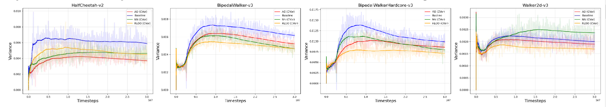
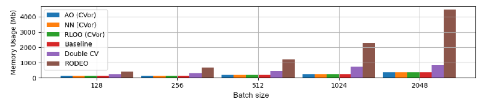
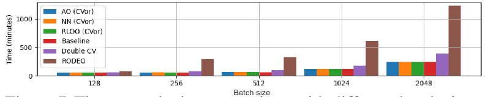

# Cvor
# Optimizing Gradient through CVor: A Universal Control Variates Operator

##  Abstract

Exact gradient estimation is crucial to deep learning training, yet the batch-based updating and nonstationarity of training data present challenges in achieving fast and stable improvements due to the high variance of estimated gradients.Control variates are a promising strategy for variance reduction in gradient estimation, yet their implementation faces significant challenges.In this paper, we present a novel control variates operator, called CVor, which eliminates the need for explicit computing the intermediate θ-specific variable c_θ(x), thus reducing computational and storage costs. CVor provides low-variance, unbiased gradient estimation for any-order derivatives. By acting on the objective function 𝓛_θ via ℋ(x), CVor transforms the gradient mapping of 𝓛_θ from ∇_θ 𝓛_θ to the control variates’ structure ∇_θ 𝓛_θ - α(∇_θ ℋ(x) - ∇_θ 𝓗̃(x)), where ∇_θ ℋ(x) is the primary function of c_θ(x). Our theoretical derivation confirms the unbiasedness and higher-order differentiability of CVor. Tested across various variational autoencoder tasks and reinforcement learning benchmarks, CVor offers reduced variance and enhances convergence without incurring additional memory overhead.

## Method

### The stochastic computation graph of loss with CVor

## Experiments

Detailed introduction to VAE experiment and SAC experiment code in the corresponding folders

## Results

### Some experimental results are as follows:

Memory usage comparison with different batch sizes

Time complexity comparison with different batch sizes

## Acknowledgement

The code is modified from Discrete Stein(https://github.com/thjashin/rodeo) and  SAC(https://github.com/pranz24/pytorch-soft-actor-critic)
